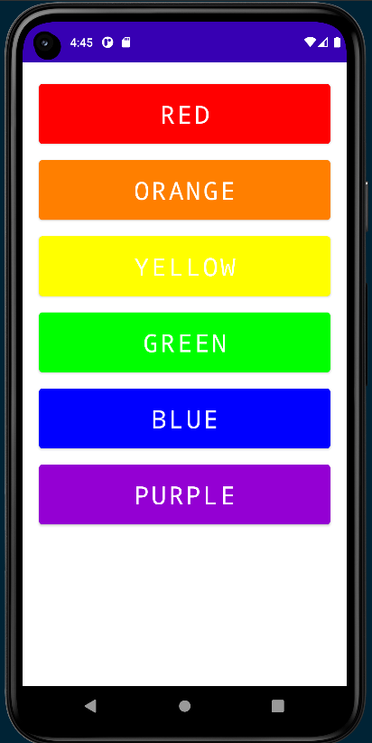

# Recyclerview + Fragments + Navigation App
The project was created to gain knowledge about combining the recyclerview with fragments and navigation component. An app is built with one activity and three fragments. On the first screen, there is a list with colors, and after clicking one of the items you are transferred to another fragment with the button "hello". After clicking that button you will see a fragment with the chosen color.

## Overview

  
  
  

# Subjects
- Navigation Component
- Safe Args
- Fragments
- Recyclerview